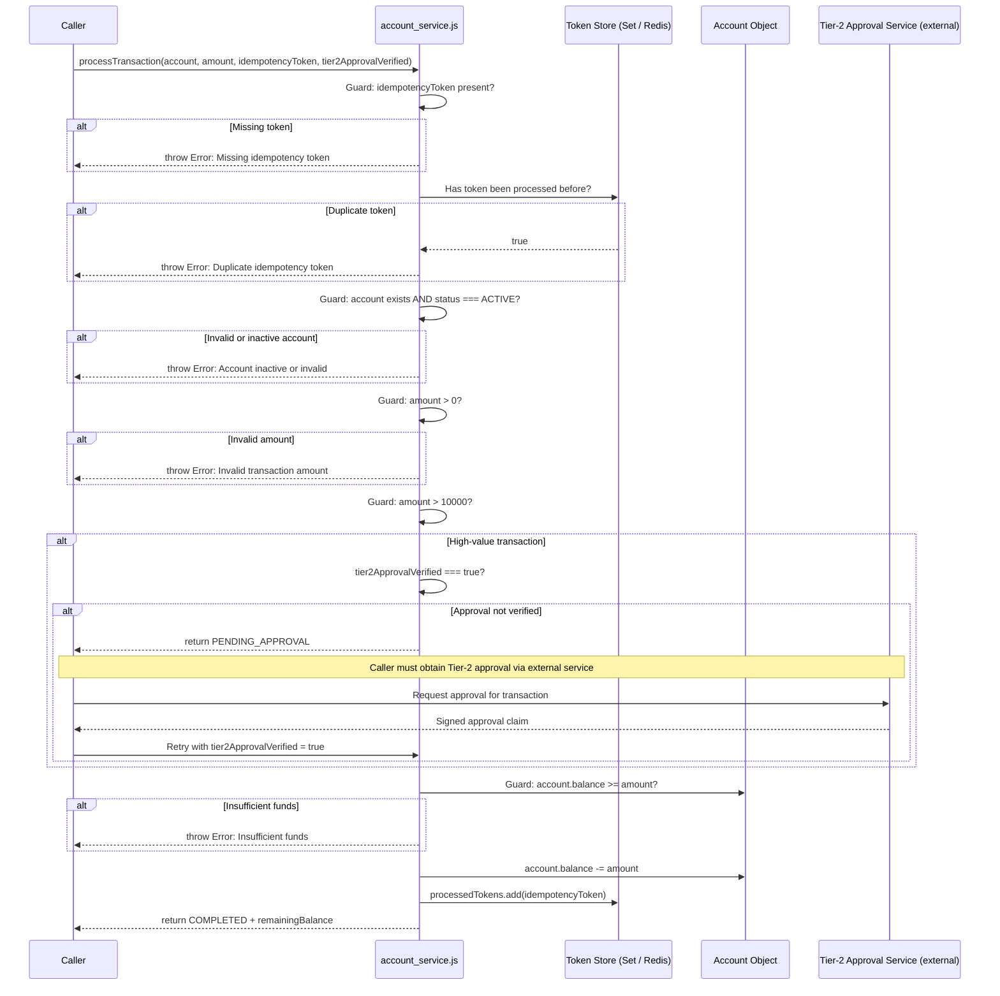
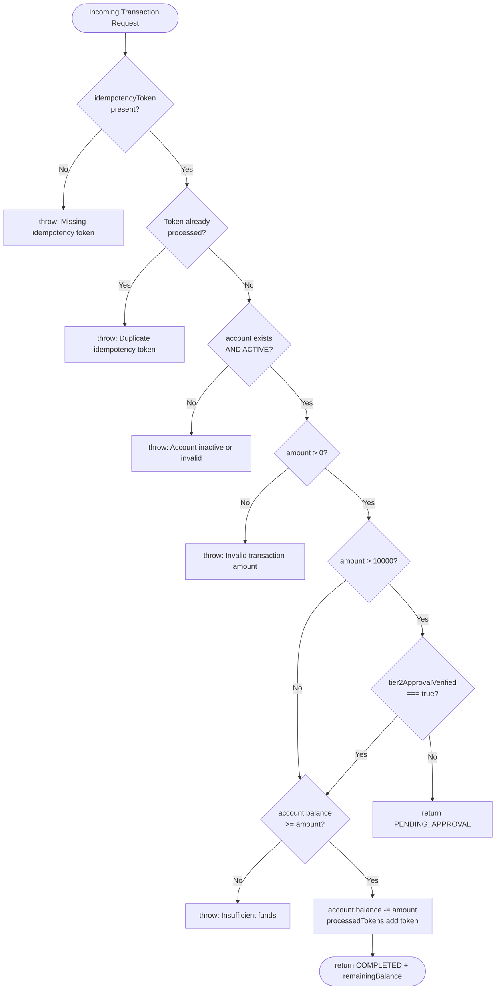
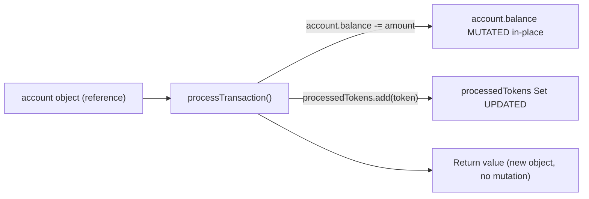
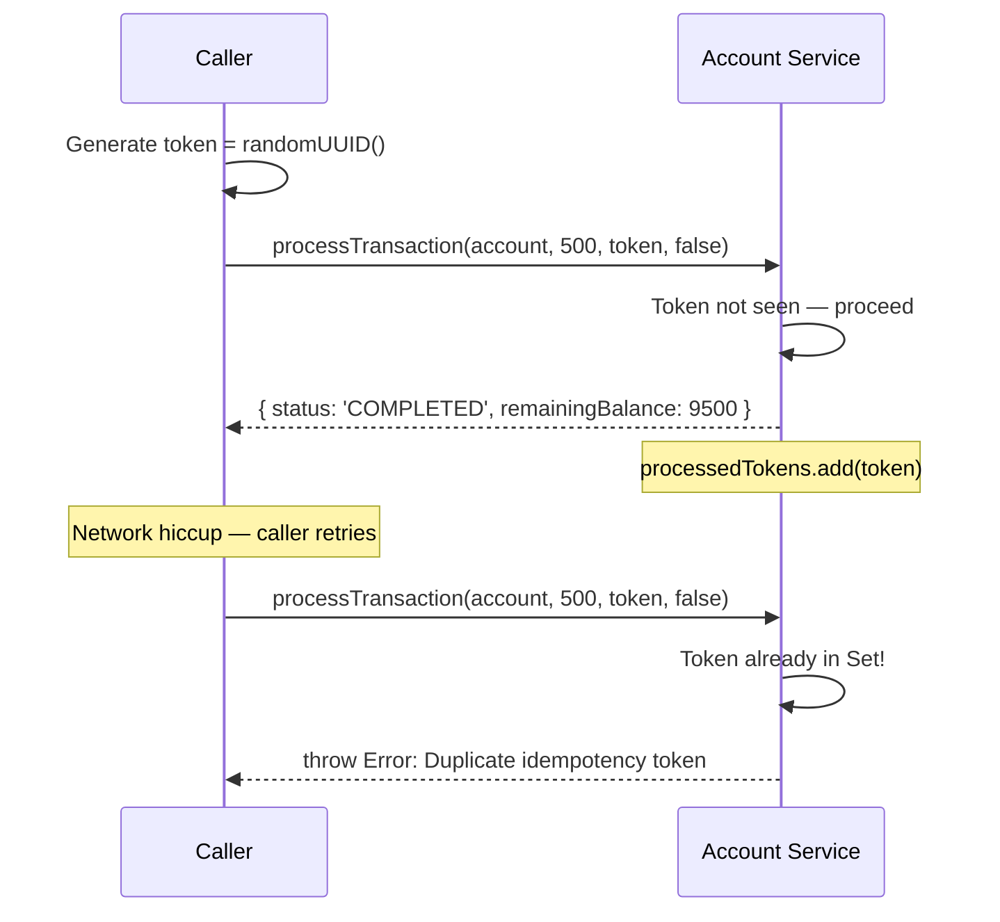
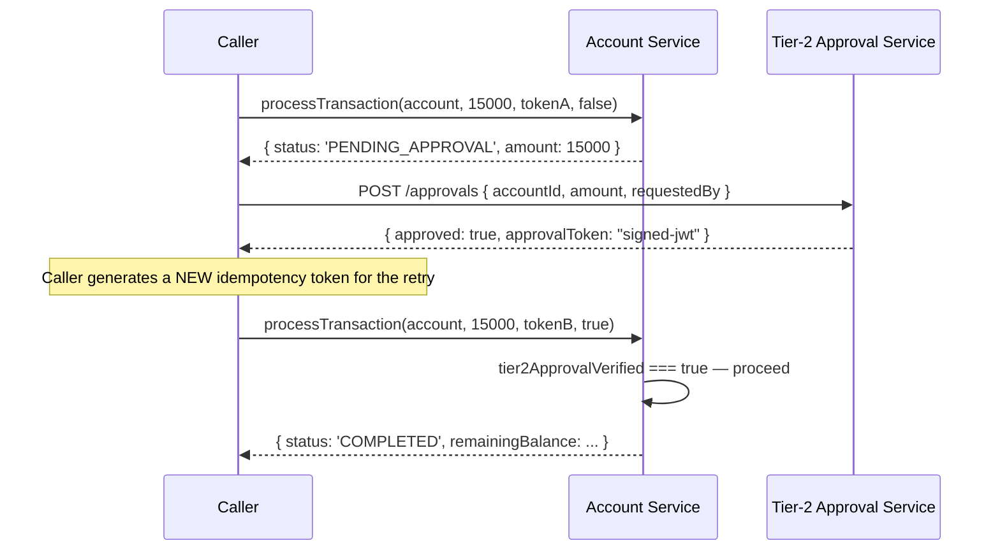

# Onboarding Guide — Account Service

> **Audience:** Engineers integrating with or maintaining the Account Transaction Processing Engine.
> **Last Updated:** Post SDLC Modernization (v2.0)

---

## Table of Contents

1. [System Overview](#1-system-overview)
2. [Architecture Diagram — Request Lifecycle](#2-architecture-diagram--request-lifecycle)
3. [Entry Points & API Reference](#3-entry-points--api-reference)
4. [Data Mutation Map](#4-data-mutation-map)
5. [Idempotency Token Guide](#5-idempotency-token-guide)
6. [Tier-2 Approval Flow](#6-tier-2-approval-flow)
7. [v1 Batch Reconciliation Migration](#7-v1-batch-reconciliation-migration)
8. [Quick-Start Code Snippet](#8-quick-start-code-snippet)
9. [System Dependencies](#9-system-dependencies)

---

## 1. System Overview

The **Account Service** is the core financial transaction processing engine for the enterprise
platform. It is the single authoritative module responsible for:

- Validating account eligibility before any monetary operation
- Enforcing Tier-2 Manager approval for high-value transactions (> $10,000)
- Guaranteeing idempotent processing — every mutation carries a unique token that prevents
  double-spend on network retries or duplicate submissions
- Maintaining non-negative account balances at all times

The service is intentionally stateless in its function logic. State (the processed-token registry
and account balance) lives outside the function to keep the processing logic pure and testable.

### Compliance Baseline (`legacy_specs.txt`)

| Spec | Requirement | Status |
|------|------------|--------|
| §1 | ACTIVE account status and non-negative balance index | ✅ Enforced |
| §2 | Tier-2 Manager approval flag for transactions > $10,000 | ✅ Enforced (see §6) |
| §3 | Idempotency token on all mutation endpoints | ✅ Enforced |
| §4 | v1 Fixed-Width Batch Reconciliation deprecated → REST event streaming | ⚠️ Migration required (see §7) |

---

## 2. Architecture Diagram — Request Lifecycle

The following sequence diagram illustrates the full lifecycle of a transaction request from
caller to response.



### Decision Flow Diagram



---

## 3. Entry Points & API Reference

### `processTransaction(account, amount, idempotencyToken, tier2ApprovalVerified)`

**Location:** [`src/account_service.js`](../src/account_service.js)

#### Parameters

| Parameter | Type | Required | Description |
|-----------|------|----------|-------------|
| `account` | `object` | Yes | Account object. Must have `status: 'ACTIVE'` and a numeric `balance`. |
| `amount` | `number` | Yes | Transaction amount. Must be `> 0`. |
| `idempotencyToken` | `string` | Yes | Unique per-request token. Re-use causes a throw (double-spend protection). |
| `tier2ApprovalVerified` | `boolean` | Conditional | Required `true` for amounts `> $10,000`. See §6. |

#### Return Values

| Outcome | Shape | Condition |
|---------|-------|-----------|
| Success | `{ status: 'COMPLETED', remainingBalance: number }` | All guards pass, balance sufficient |
| Pending | `{ status: 'PENDING_APPROVAL', amount: number }` | Amount > $10k and approval not yet verified |

#### Throws

| Error Message | Condition |
|--------------|-----------|
| `Missing idempotency token` | `idempotencyToken` is falsy |
| `Duplicate idempotency token: transaction already processed` | Token was previously committed |
| `Account inactive or invalid` | `account` is null/undefined or `account.status !== 'ACTIVE'` |
| `Invalid transaction amount` | `amount <= 0` |
| `Insufficient funds: transaction would result in a negative balance` | `account.balance < amount` |

### `processedTokens` (exported `Set<string>`)

A module-scoped `Set` tracking all committed idempotency tokens. Exported for test isolation
(call `processedTokens.clear()` in `beforeEach`). **In production, replace with Redis or a
distributed cache** so the token store survives process restarts and scales horizontally.

---

## 4. Data Mutation Map



### Key Facts

- **`account.balance`** is the **only** field mutated on the account object.
- Mutation is **in-place** — the caller's object reference is modified directly.
- There is **no rollback** mechanism at this layer. If downstream operations fail after
  `processTransaction` returns `COMPLETED`, the caller is responsible for compensating transactions.
- The **idempotency token store** (`processedTokens`) is also mutated on success, providing
  replay protection.

> ⚠️ **Production Recommendation:** Wrap calls to `processTransaction` in a transactional
> boundary (database transaction, saga orchestrator) to enable rollback. The current in-process
> mutation is suitable for single-node, synchronous workloads only.

---

## 5. Idempotency Token Guide

### What Is an Idempotency Token?

An idempotency token is a unique string that the caller generates **once per intended
transaction**. If the caller retries a request (due to a network timeout, for example), they
send the **same token** again. The service detects the duplicate and throws rather than
processing the transaction twice — preventing double-spend.

### How to Generate a Token

```javascript
// Recommended: UUID v4 (universally unique, 122 bits of entropy)
const { randomUUID } = require('crypto');
const token = randomUUID(); // e.g. "550e8400-e29b-41d4-a716-446655440000"
```

### Token Lifecycle



### Rules

1. Generate one token **per intended transaction**, not per HTTP call.
2. On a **safe retry** (same intent), reuse the same token.
3. For a **new transaction** (different intent), generate a new token.
4. Tokens are currently held in-process memory. In production, persist them with a TTL
   (e.g. 24 hours) in a distributed store.

---

## 6. Tier-2 Approval Flow

Transactions exceeding **$10,000.00** require verified Tier-2 Manager approval before
the balance deduction is committed. This is a hard regulatory control (Spec §2).

### How It Works Today

The `tier2ApprovalVerified` parameter is a **boolean** passed by the caller. When `false` (or
absent) for a high-value transaction, the service returns `PENDING_APPROVAL` without mutating
the balance. The caller is then responsible for routing to an external Tier-2 Approval Service,
obtaining approval, and retrying with `tier2ApprovalVerified: true` **and a new idempotency token**.

> ⚠️ **Known Gap (TODO):** The current boolean is caller-asserted and **not cryptographically
> verified**. A malicious or buggy caller can pass `true` without real approval. The production
> target is to replace this boolean with a **signed approval claim** (e.g. a short-lived JWT
> issued by the Tier-2 Approval Service) that `processTransaction` validates before proceeding.

### Tier-2 Approval Sequence



### Boundary Condition

- Amount of exactly **$10,000** is **not** subject to Tier-2 approval (the guard is `> 10000`, not `>= 10000`).
- Amount of **$10,000.01** triggers the approval gate.

---

## 7. v1 Batch Reconciliation Migration

### Deprecation Notice

> **The v1 fixed-width batch reconciliation pattern is formally deprecated** per `legacy_specs.txt §4`.
> All consumers must migrate to REST event streaming.

### What Was v1?

The v1 pattern used fixed-width flat files processed in scheduled batch jobs:

```
# v1 — DEPRECATED — DO NOT USE
# Fixed-width batch record format (example):
# [ACCT_ID: 10][TXN_ID: 12][AMOUNT: 10][TIMESTAMP: 19][STATUS: 8]
# 1234567890TX-00000000100000.00 20240101T120000COMPLETE
```

Problems with this pattern:
- Not idempotent — duplicate records in the batch caused double-processing
- No real-time visibility — failures discovered hours after the fact
- Incompatible with the idempotency token system introduced in v2

### Target Pattern — REST Event Streaming

```javascript
// v2 Target — REST Event Streaming (pseudo-code)
// Each transaction is an event published to a stream endpoint

// Producer (replaces batch file write)
async function publishTransactionEvent(account, amount, token) {
  const event = {
    eventType: 'TRANSACTION_REQUESTED',
    idempotencyToken: token,        // Required — prevents replay
    accountId: account.id,
    amount,
    timestamp: new Date().toISOString(),
  };
  await eventStreamClient.publish('/v2/transaction-events', event);
}

// Consumer (replaces batch processor)
eventStreamClient.subscribe('/v2/transaction-events', async (event) => {
  const { processTransaction } = require('./account_service');
  const account = await accountRepository.findById(event.accountId);
  try {
    const result = processTransaction(account, event.amount, event.idempotencyToken, false);
    await eventStreamClient.ack(event.id);
    console.log('Transaction processed:', result);
  } catch (err) {
    await eventStreamClient.nack(event.id, err.message);
  }
});
```

### Migration Checklist

- [ ] Identify all consumers still generating v1 fixed-width batch files
- [ ] Provision a REST event stream endpoint (`/v2/transaction-events`)
- [ ] Update producers to call the stream endpoint instead of writing batch files
- [ ] Update consumers to subscribe to the stream and call `processTransaction` per event
- [ ] Validate idempotency token generation is in place for every published event
- [ ] Run parallel processing (v1 + v2) for one billing cycle to validate parity
- [ ] Decommission v1 batch job and file infrastructure

---

## 8. Quick-Start Code Snippet

```javascript
const { randomUUID } = require('crypto');
const { processTransaction, processedTokens } = require('./src/account_service');

// Example account object
const account = {
  id: 'ACC-001',
  status: 'ACTIVE',
  balance: 5000.00,
};

// --- Standard transaction (under $10k) ---
const token = randomUUID();
try {
  const result = processTransaction(account, 250.00, token, false);
  console.log(result); // { status: 'COMPLETED', remainingBalance: 4750 }
} catch (err) {
  console.error('Transaction failed:', err.message);
}

// --- High-value transaction (over $10k, requires Tier-2 approval) ---
const highValueToken = randomUUID();
const pendingResult = processTransaction(account, 15000, highValueToken, false);
// pendingResult => { status: 'PENDING_APPROVAL', amount: 15000 }
// ... obtain Tier-2 approval via external service ...
const approvedToken = randomUUID(); // New token for the approved retry
const approvedResult = processTransaction(account, 15000, approvedToken, true);
// approvedResult => { status: 'COMPLETED', remainingBalance: ... }

// --- Safe retry (same token, idempotent) ---
try {
  processTransaction(account, 250.00, token, false); // token already used above
} catch (err) {
  console.error(err.message); // "Duplicate idempotency token: transaction already processed"
}
```

---

## 9. System Dependencies

| Dependency | Type | Purpose | Production Replacement |
|-----------|------|---------|----------------------|
| `processedTokens` (in-memory `Set`) | Internal | Idempotency token store | Redis / distributed cache with TTL |
| `account.balance` (in-process object) | External | Account state | Relational DB / ledger service with row locking |
| `tier2ApprovalVerified` (boolean) | External | High-value approval claim | Signed JWT from Tier-2 Approval Service |
| Fixed-width batch files (v1) | **DEPRECATED** | Reconciliation | REST event stream (`/v2/transaction-events`) |

---

*For security considerations and risk findings, see [`docs/security-risk-audit.md`](./security-risk-audit.md).*
*For the full test suite, see [`src/__tests__/account_service.test.js`](../src/__tests__/account_service.test.js).*
